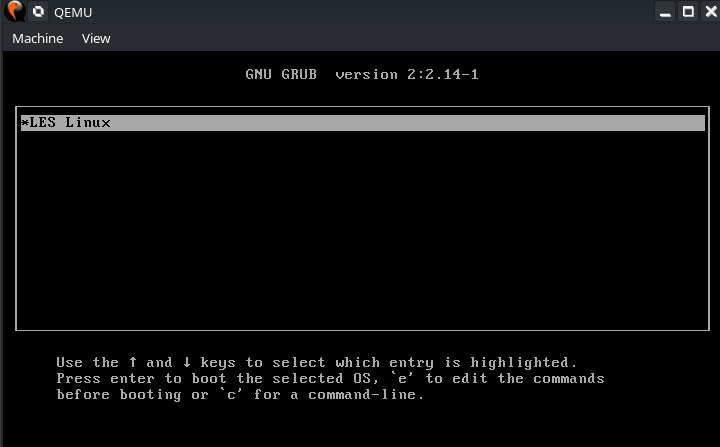
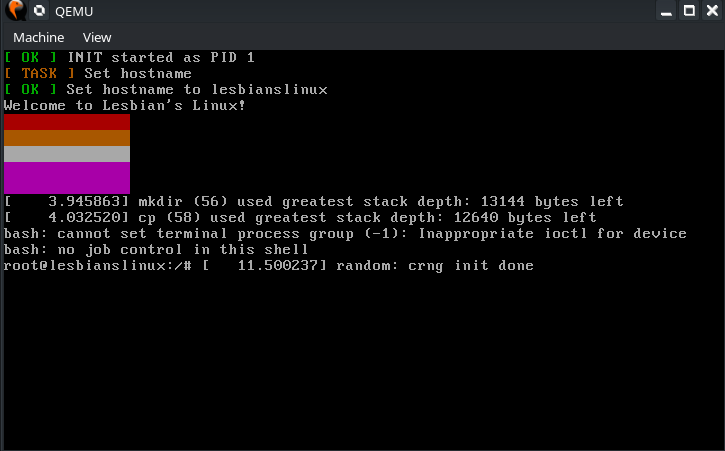
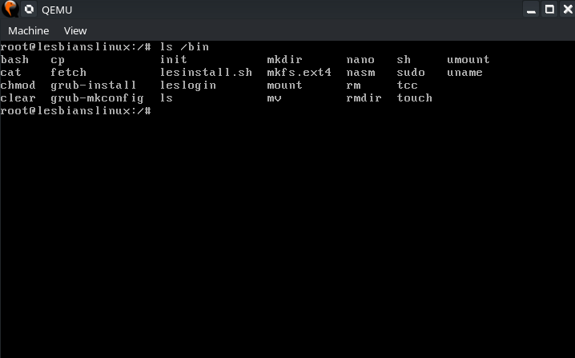

# LesLinux
# Version: 0.2.0
This distro is a Hobby distro designed to "at least half-work", which it dose.

It is installable. The installer is at /bin/lesinstall.sh (During boot)

## INSTALL TIPS

To install, you can view the buildirfs.sh script. I recommend creating a raw disk image to use this with.

Here are some instructions i found best.

1. After booting the installer media, you should be at a bash prompt
2. Type `lesinstall.sh`
3. It will ask if you are sure. Press any key.
4. LesLinux will begin installing itself to /dev/sda (This will wipe the whole drive! Be careful!)
5. Some programs it uses may have a prompt themselves, just accept.
6. When you get back to the bash prompt, reboot qemu before shutting it down to make sure the drive is synced.
7. You may then use the installed image however you like.

## REAL HARDWARE

I have not tested this on real hardware yet.

I dont really know how you would do this.

Probably by installing it in qemu and flashing the image to a USB.

## PREVIEWS

Here are some images i screenshotted from an installed system.

# CHANGELOG

## Release 0.1.0

First release

## Release 0.2.0

Second release
+ framebuffer support
+ virtio-gpu support
+ /dev/fb0
* note: tried to get X11 working, failed

